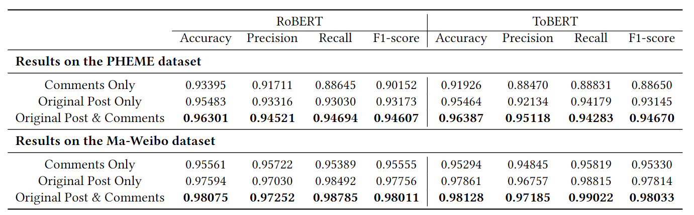
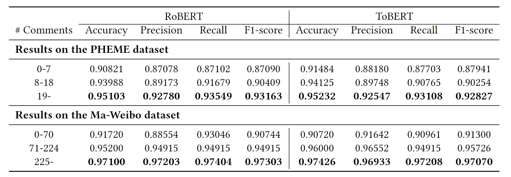
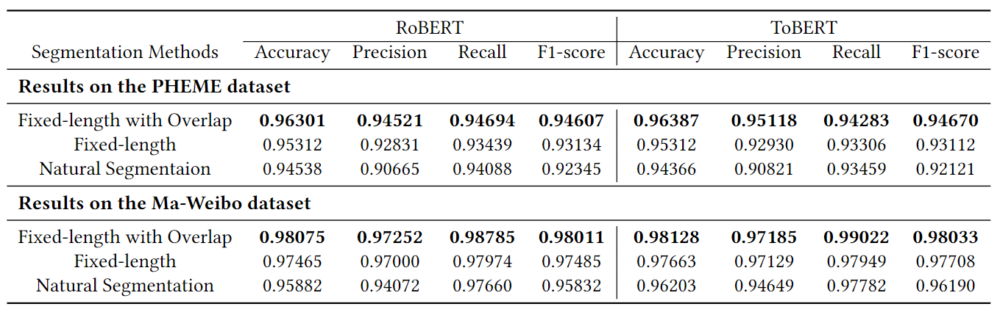

## Improving Rumour Detection with User Comments


### 1. Project Introduction

- In this project, we propose a new **BERT-based** rumour detection method considering **both the original post and the associated comments**. 
- The method starts with concatenation of the original post and the associated comments to form a single long text, which is then segmented into shorter sequential chunks more suitable for BERT-based vectorization. Features extracted by applying BERT to all the trunks are fed into an LSTM- or transformer-based classifier for the binary (i.e., *'rumour'* or *'non-rumour'*) classification task. 
- The experimental results on **PHEME** and **Ma-Weibo**, two public rumour detection datasets representing the two most spoken languages -- English and Chinese --  and two of the largest Web 2.0 platforms -- Twitter and Sina Weibo, showed that our method outperformed other state-of-the-art methods, mostly with a significant margin.

---

### 2. Implementation Requirements & Preparations

* **Data Preparations**

  Please download the datasets and trained models from the google drive links below and place these file folders in the corresponding working directories. 

  * [Datasets Download Link](https://drive.google.com/drive/folders/1o430G2HXg9k5cWCOkPwmhOT_7boUii8i?usp=sharing)

  * [Trained Models Download Link](https://drive.google.com/drive/folders/1VEtruvbJ9eRMC4BttXgvz9A0h76HgUIP?usp=sharing) (Not Necessary)


* **Recommended Environments to Run Codes (Win/Linux)**
  * python 3.7 or higher
  * numpy 1.18.5
  * pytorch 1.7.0 (with CUDA Version 11.5)
  * torchtext 0.6.0
  * tensorflow 2.0.0
  * transformers 4.9.2

---

### 3. Implemetation Guide

There are two jupyter notebooks in each folder. The *"Data_Preprocess.ipynb"* notebook converted the original dataset (i.e., Ma-Weibo and PHEME) to *"raw_data.csv"* files, while the *"Rumour_BERT.ipynb"* performed the rumour detection and binary (i.e., *'rumour'* or *'non-rumour'*) classification task. The specific introduction is as follows.

* **Data_Preprocess.ipynb**

  * This notebook preprocessed the original dataset and generated a *".csv"* file in *"./data"'* folder. 
  * A **'raw_data.csv'** file has already been generated in each folder in [datasets download link](https://drive.google.com/drive/folders/1o430G2HXg9k5cWCOkPwmhOT_7boUii8i?usp=sharing), so you may alternatively skip this notebook after download the dataset and proceed to *"Rumour_BERT.ipynb"*.

  ---

* **Rumour_BERT.ipynb**

  There are 7 steps in this jupyter notebook, the final result is in Step 6 (RoBERT) and Step 7 (ToBERT) output, measured with four indicators (i.e., *accuracy*, *precision*, *recall* and *f1-score*).

  * Step 1: Process the *"raw_data.csv"* and generate the original train and test data.
  * Step 2: Define and construct the BERT model for text classification.
  * Step 3 & 4: Fine-tune, train and evaluate the BERT model.
  * Step 5: Get the text embeddings and prepare datas for the final classification model.
  * Step 6: Construct, train and evaluate the **RoBERT** (Recurrence over BERT).
  * Step 7: Construct, train and evaluate the **ToBERT** (Transformer over BERT).

  *Some Extra Explanations:*

  - *The accuracy result in Step 4 is only for the BERT model, it is **NOT** the final result.*
  - *You could alternatively use my own "pre-trained"  BERT models so you don't have to train and fine-tune the BERT model again.*
    - *Place my trained model (links above) in "**./trained_models**" folder.*
    - ***Skip Step 3 & Step 4**.*

---

### 4. Settings for Different Model Path (Additional Experiments)

We conducted additional experiments on different settings of our proposed method to study diferent aspects of the role comments play in the rumour detection task. These additional experiments led to some very interesting findings, including further evidence that including the associated comments is beneficial, the surprising result that fixed-length segmentation with an overlap is better than natural segmentation, and the observation that the more comments the better the detector's performance. 

To reproduce these experiment results, please change the **'model_name'** in "Rumour_BERT.ipynb" to coressponding values. Optional values and the settings are listed below.

* **text_comments** (Default), **text_only**, **comments_only**

  * Set the 'model_path' to **'text_comments'** (Default), **'text_comments'** or **'comments_only'**.

  * Use the following lines in notebook cell *"\## Data Selection ##"*.

    * text_comments
    
      ```python
      raw_data = raw_data[['text_comments','label']]
      raw_data = raw_data.rename(columns = {'text_comments':'text'})
      ```
    
    * text_only
    
      ```python
      raw_data = raw_data[['text_only','label']]
      raw_data = raw_data.rename(columns = {'text_only':'text'})
      ```
    
    
    * comments_only
    
      ```python
      raw_data = raw_data[['comments_only','label']]
      raw_data = raw_data.rename(columns = {'comments_only':'text'})
      ```
    
      

* **comments_group1**, **comments_group2**, **comments_group3**

  * Set the 'model_path' to **'comments_group1'**, **'comments_group2'** or **'comments_group3'**.

  * Uncomment the corresponding lines in Cell *"\## Different Number of Comments ##"*.

    * comments_group1

      ```python
      # For 'Ma-Weibo' Dataset
      raw_data = raw_data[raw_data['count'] <= 70]
      
      # For 'PHEME-RNR' Dataset
      raw_data = raw_data[raw_data['count'] <= 7]
      ```

    * comments_group2

      ```python
      # For 'Ma-Weibo' Dataset
      raw_data = raw_data[raw_data['count'] > 70]
      raw_data = raw_data[raw_data['count'] <= 224]
      
      # For 'PHEME-RNR' Dataset
      raw_data = raw_data[raw_data['count'] > 7]
      raw_data = raw_data[raw_data['count'] <= 18]
      ```

    * comments_group3

      ```python
      # For 'Ma-Weibo' Dataset
      raw_data = raw_data[raw_data['count'] > 224]
      
      # For 'PHEME-RNR' Dataset
      raw_data = raw_data[raw_data['count'] > 18]
      ```

* **natural_split**, **fixed_split**
  
  * Set the 'model_path' to **'natural_split'** or **"fixed_split"**.
  * In Step 1.2, Use **'get_natural_split'** or **'get_fixed_split'** function rather than 'get_split'.

---

### 5. Results

* **Rumour Detection Results with Different Settings of Using the Original Post and the Associated Comments**

  

* **Rumour Detection Results with Different Number of Comments**

  

  * **One-way ANOVA (Analysis of Variance) Verification**

    To further demonstrate that the effect of the number of comments on the accuracy of rumour detection is statistically significant, we performed ANOVA tests on the three data groups for each dataset. Here, our variable *X* is the range of comments number in each data group, and the response data *Y* is the accuracy of the corresponding rumour detection.We set α value to **0.001**. 

    

* **Rumour Detection Results with Different Segmentation Methods**

  

